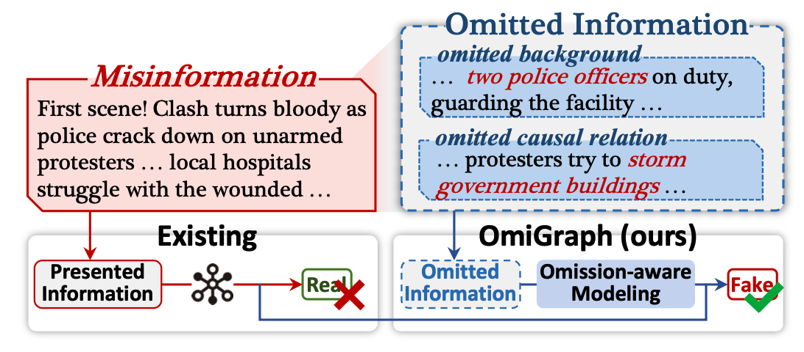
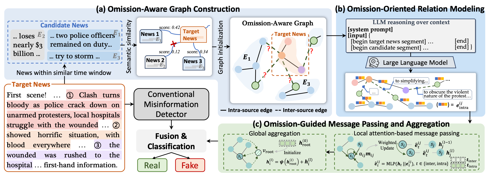

# OmiGraph
Official repository for "Reasoning About the Unsaid: Misinformation Detection with Omission-Aware Graph Inference", AAAI 2026.

```

```

- 🛠️ Project: https://github.com/ICTMCG/OmiGraph
- 🔗 Paper: 
- 🏡 Home page: https://zhengjiawa.github.io/

---

<div align="center">

  

  <p>"Learning from omission" for misinformation detection.</p>

</div>
 
**🌟 TL;DR:**

This paper introduces OmiGraph, the first omission-aware misinformation detection framework. By recognizing that deception operates not only through what is explicitly stated but also through what is deliberately _omitted_, OmiGraph addresses a critical yet underexplored dimension of news deception.

## 🏠 Method

<div align="center">

  

  <p>Overview of OmiGraph.</p>

</div>

We presented **OmiGraph, the first omission-aware framework for misinformation detection**. OmiGraph introduces
omission-aware message-passing and aggregation that establishes holistic deception perception by integrating the omission contents and relations.

- constructs an omission-aware graph based on the contextual environment (a)
- omission-oriented relation modeling reasons over the graph nodes, identifying intra-source contextual dependencies and inter-source omission intents (b)
- an omission-guided message passing mechanism extracts omission-oriented deception features (c) to enhance conventional misinformation detectors

This research highlights how **“_Learning From Omission_”** offers a fundamentally novel and versatile paradigm. By demonstrating the feasibility and value of omission-aware modeling, OmiGraph opens new avenues for future research in trustworthy and interpretable misinformation mitigation solutions that can better serve the growing need in our increasingly complex media landscape.

## 📦 File Structure
```
📦OmiGraph
 ┣ 📂models
 ┃ ┣ 📜__init__.py
 ┃ ┣ 📜bert.py
 ┃ ┣ 📜layers.py
 ┃ ┗ 📜omi_graph.py
 ┣ 📂utils
 ┃ ┣ 📜dataset.py
 ┃ ┣ 📜misc.py
 ┃ ┗ 📜utils.py
 ┣ 📜README.md
 ┣ 📜engine.py
 ┣ 📜main.py
 ┗ 📜train.sh
```

## 🚀 Usage

### Prepare Datasets

You can download the dataset from "Zoom Out and Observe: News Environment Perception for Fake News Detection (Sheng et al., ACL 2022)", and then place them to the folder `./data`;

### Run

Run the shell script:

```shell
bash train.sh
```

Revise the storage locations for the model and results if needed.

## 📖 Citation

If you find this repository useful, please cite our paper:

```

```
